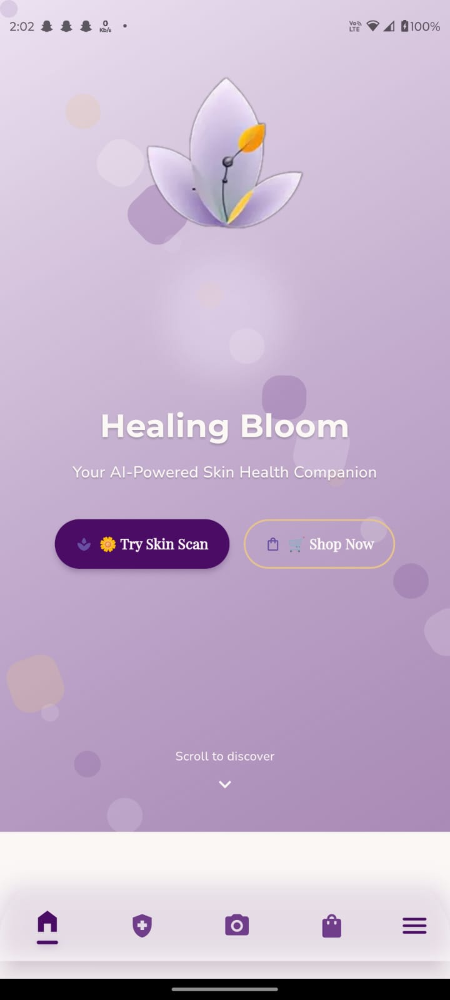
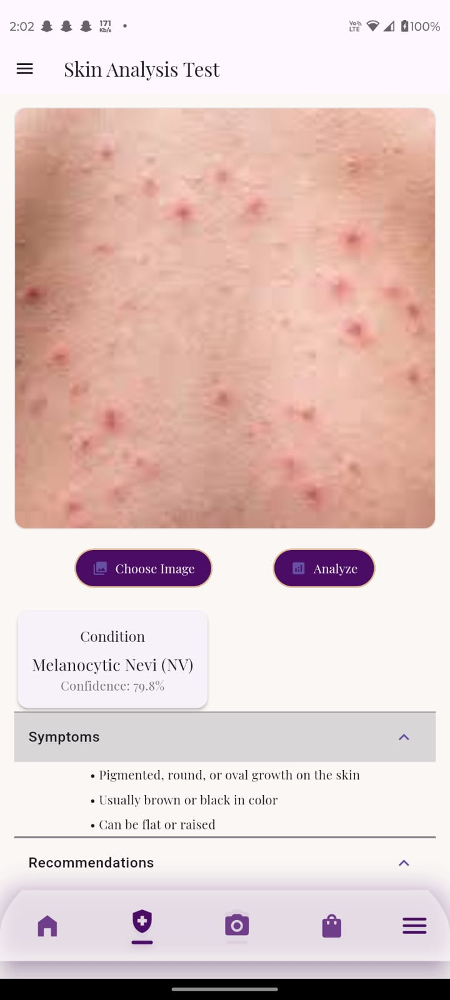
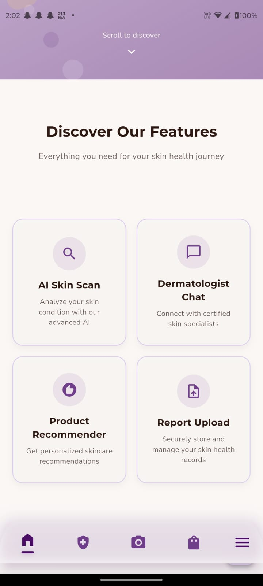
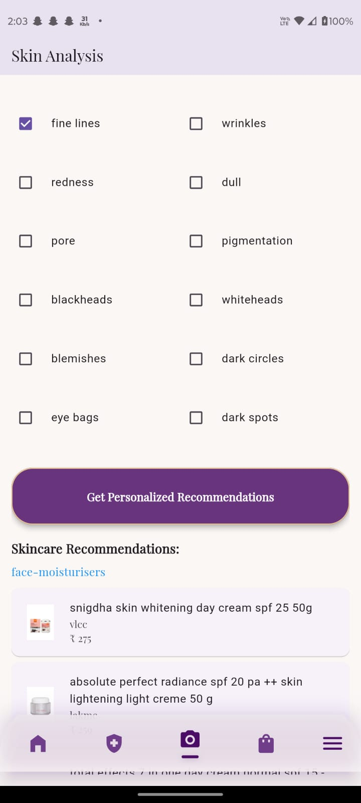
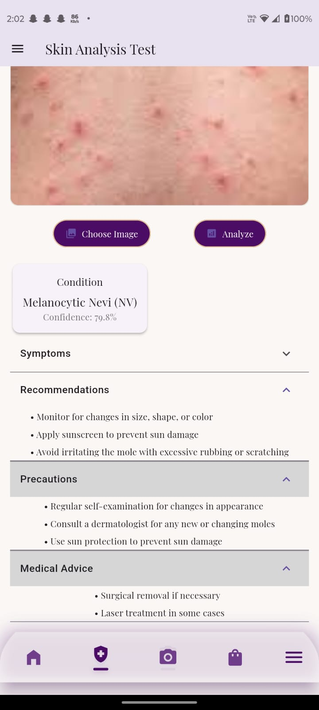
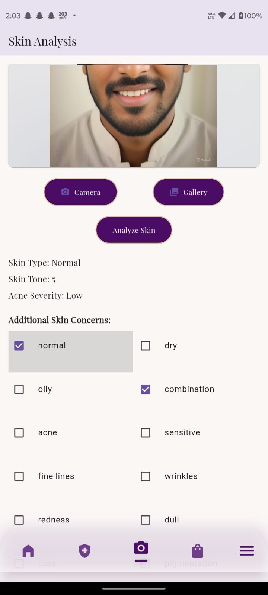
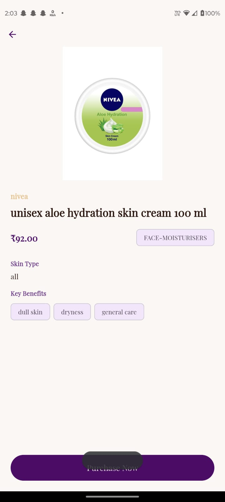
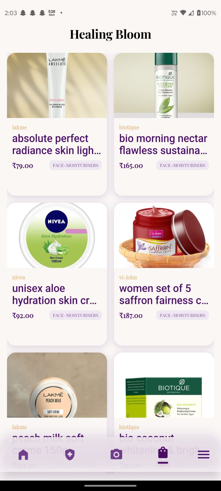

# Healing Bloom -  Skin Disease Identification App
Healing Bloom is a mobile application designed to help users identify skin diseases using advanced image recognition and offer personalized product recommendations. The app uses **Inspection Rusnet V2** for skin disease detection and integrates face scanning features to suggest relevant products. Additionally, users can explore and shop for medicines and cosmetics from an integrated online shopping platform.
<p align="center">
  
</p>

---

## 🔹 Features

### 1. Skin Disease Identification  
<p align="center">
  
</p>
- Detects and identifies possible skin diseases using **Inspection Rusnet V2**.  
- Supports scanning **photos from camera or gallery**.  

### 2. Face Scanning for Product Recommendations  
<p align="center">
  
</p>
- Scans user’s face to suggest **skincare and cosmetic products** tailored to skin type.  
- Works seamlessly with the recommendation engine.  

### 3. Integrated Shopping Platform  
<p align="center">
  
</p>
- Browse categories like **Medicines** and **Cosmetics**.  
- Filter, search, and sort products.  
- Add to cart and checkout securely.  

### 4. Personalized Recommendations  
<p align="center">
  
</p>
- Suggests **skincare routines** and **products** based on detected skin conditions.  

---

## 💻 Requirements

- **Flutter SDK**: 3.x or higher  
- **Dart SDK**: 2.x or higher  
- **IDE**: Android Studio or VS Code  
- **Supported Platforms**: Android & iOS  

---

## ⚡ Installation

```bash
git clone https://github.com/yourusername/healing_bloom.git
cd healing_bloom
flutter pub get

If you're new to Flutter, follow the official installation guide
.

🧠 Setting Up Inspection Rusnet V2
<p align="center">  </p>

Steps to integrate Inspection Rusnet V2 for skin disease detection:

Download the TFLite model.

Integrate the model into the Flutter app.

Run sample tests using camera or gallery images.

Use TensorFlow Lite or any Flutter-compatible ML framework to load and run the model.

🔍 Face Scanning & Product Recommendation
<p align="center">  </p>

Implement face detection using packages like Google ML Kit
.

Feed results into the recommendation engine.

Display personalized products to users.

🛒 Shopping Platform
<p align="center">  </p>

Browse Medicines & Cosmetics

Search, filter, and sort products

Add to cart and complete purchase securely

🏗️ Project Structure
/healing_bloom
|-- /images               # UI images (img1.jpg - img10.jpg)
|-- /lib
|   |-- /screens
|   |-- /models
|   |-- /services
|   |-- main.dart
🎯 Usage
Scan Skin
<p align="center">  </p> 1. Open **Scan Skin** tab 2. Take or upload a photo 3. View **disease prediction** and related products
Scan Face for Products

Open Face Scan tab

Grant camera access

Get personalized recommendations

Shopping
<p align="center">  </p> 1. Browse products 2. Add to cart 3. Complete purchase
🛠️ Technologies Used

Flutter & Dart

TensorFlow Lite (Inspection Rusnet V2)

Firebase (Optional Backend)

Face Detection (Google ML Kit or alternative)

REST APIs for shopping integration

🔗 Backend Reference

For backend APIs, database integration, and admin functionality, check out the Healing Bloom Backend repository:
Healing Bloom Backend

🚀 Future Enhancements

User login & profile management

Skin history tracking

Routine reminders

Multi-language support

🏆 Academic Achievements & Highlights

Published a conference paper at ICTEST IEEE Conference

Won Hackathon at college

Invited to teach AI & Python workshops for students

🤝 Contributing

Pull requests are welcome!

git checkout -b feature-name
git commit -m "Add new feature"
git push origin feature-name

Open a PR on GitHub. 🎉

📸 Preview Gallery
<p align="center">  &nbsp;  &nbsp;  </p> ```
